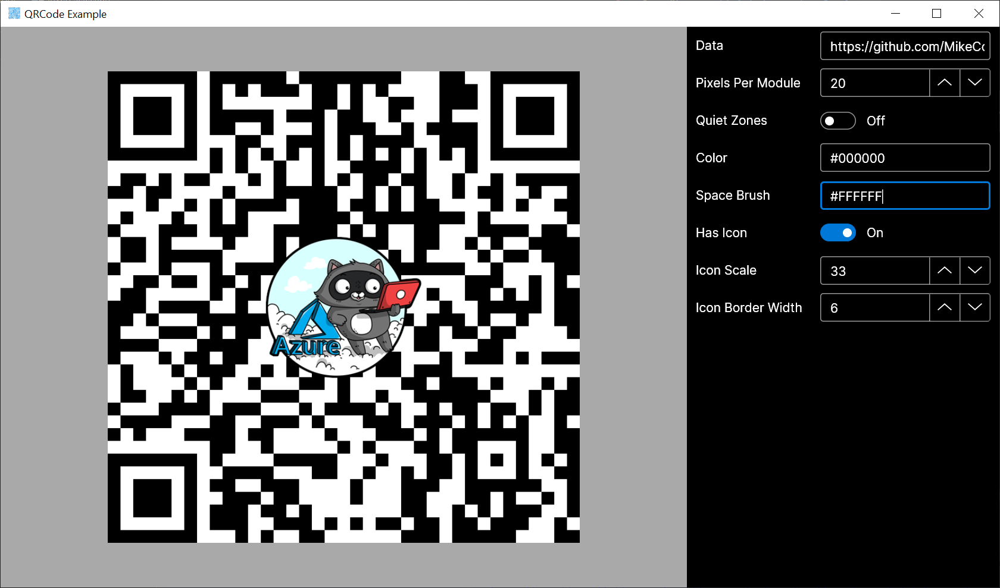

# Avalonia QRCode Control


[](https://www.nuget.org/packages/QRCode.Avalonia/)

by [Mike James](https://twitter.com/mikecodesdotnet)


# Using the control 




I've included a sample app to demonstrate the functionality of the control. It's a straightforward control, and thus should be self-explanatory. 

### Create a QR Code pointing to GitHub
```
<qr:QRCode Data="https://github.com" />
```

### Change the colors
```
<qr:QRCode Data="https://github.com" 
           Color="Red" 
           SpaceBrush="Blue" />
```

### Remove the border
```
<qr:QRCode Data="https://github.com" 
           DrawQuietZones="false" />
```

### Include an icon image
```
<qr:QRCode Data="https://github.com" 
           Icon="/Assets/yourImage.png" />
```

[QRCoder](https://github.com/codebude/QRCoder/) powers the bitmap generation; you should check it's comprehensive [documentation](https://github.com/codebude/QRCoder/wiki) for more information. 
